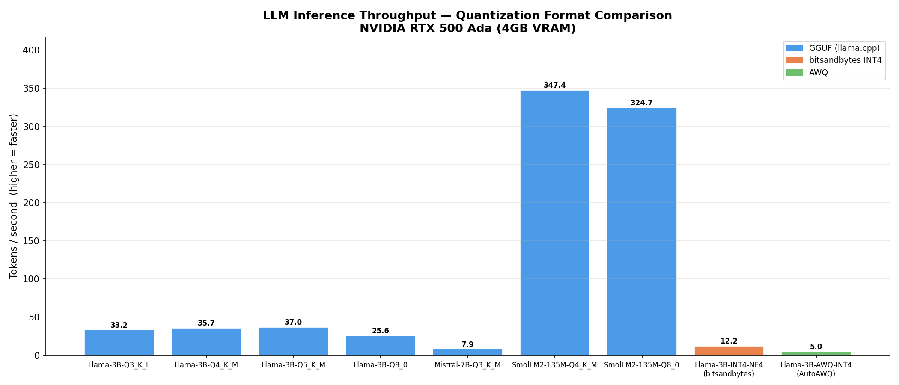
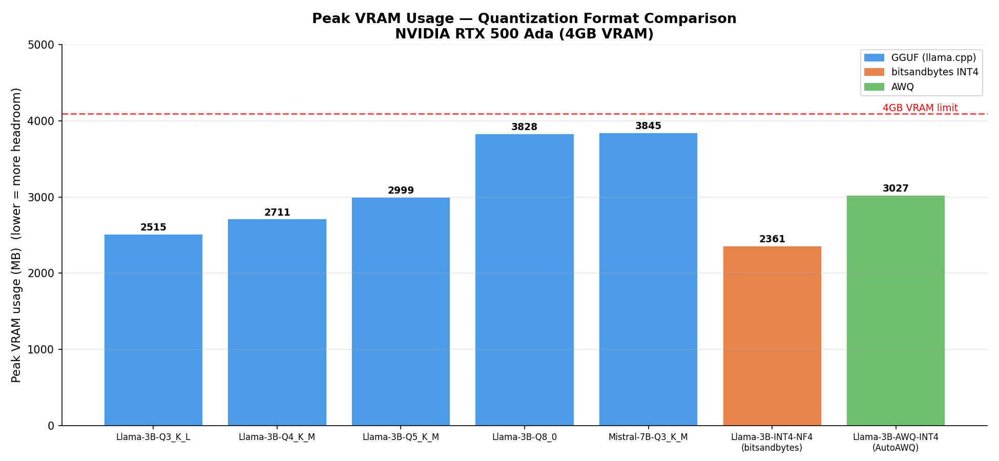
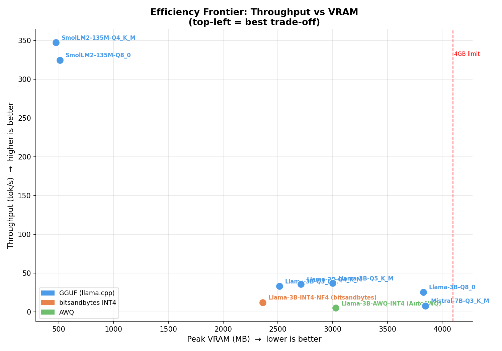

# LLM Quant Bench

> A hands-on benchmarking suite that measures inference speed, VRAM usage, and latency across three quantization backends — GGUF (llama.cpp), bitsandbytes NF4, and AWQ — on a consumer-grade 4GB GPU, with a live interactive web UI to run any model with a custom prompt.

**Hardware:** NVIDIA RTX 500 Ada Generation Laptop GPU · 4GB VRAM · Intel Core Ultra 7 165H · 15GB RAM · Ubuntu 24.04 WSL2 · CUDA 12.6

---

## Benchmark Results

### GGUF (llama.cpp) — Llama-3.2-3B-Instruct

| Format | Bits/weight | Tok/s | VRAM (MB) | Notes |
|--------|-------------|-------|-----------|-------|
| Q3_K_L | ~3.4 | 33.2 | 2515 | Most compressed |
| Q4_K_M | ~4.5 | 35.7 | 2711 | Sweet spot — best speed/quality balance |
| Q5_K_M | ~5.5 | **37.0** | 2999 | Fastest overall |
| Q8_0   | ~8.0 | 25.6 | 3828 | Near-lossless quality |

### Cross-Backend Comparison — Llama-3.2-3B-Instruct @ INT4

| Backend | Tok/s | VRAM (MB) | TTFT (ms) | Load time |
|---------|-------|-----------|-----------|-----------|
| GGUF Q4_K_M — llama.cpp | **35.7** | 2711 | — | < 1s |
| bitsandbytes NF4 | 12.2 | **2361** | 335 | 6.7s |
| AutoAWQ INT4 | 5.0 | 3027 | 590 | 6.6s |

### Mistral-7B-Instruct-v0.3 (GGUF only)

| Format | Tok/s | VRAM (MB) | Notes |
|--------|-------|-----------|-------|
| Q3_K_M | 7.9 | 3845 | Barely fits in 4GB |
| Q4_K_M | OOM | — | 4.1GB model + KV cache exceeds 4GB VRAM |

---

## Result Plots

**Throughput Comparison — tok/s across all models and backends**



---

**VRAM Usage — peak memory with 4GB hardware limit marked**



---

**Efficiency Frontier — throughput vs VRAM trade-off (top-left = best)**



---

## Web UI

A FastAPI + vanilla JS single-page interface to run any model interactively with a custom prompt, stream tokens live, and compare results across runs.

**Features:**
- Model selector cards — GGUF variants, bitsandbytes INT4, AWQ
- Live token streaming via Server-Sent Events (SSE)
- Metrics panel — tok/s, VRAM, TTFT, load time shown after each run
- Run history table — compare results across models in one session

---

## What It Does

1. **Benchmarks GGUF quantized models** via llama.cpp — measures generation throughput and peak VRAM across Q3, Q4, Q5, Q8 formats
2. **Benchmarks bitsandbytes NF4** — loads the original float16 model and quantizes on-the-fly to INT4 using HuggingFace transformers
3. **Benchmarks AWQ INT4** — loads a pre-quantized activation-aware model via AutoAWQ
4. **Generates analysis and plots** — bar charts, VRAM comparison, and efficiency frontier scatter plot
5. **Serves a web UI** — select any model, enter a prompt, watch tokens stream in real time, view metrics and run history

---

## Architecture

```
┌──────────────────────────────────────────────────────────────┐
│                  Browser — Single Page UI                    │
│  Model selector cards  │  Prompt input  │  Token stream      │
│  Metrics panel         │  Run history table                  │
└────────────────────────┬─────────────────────────────────────┘
                         │ POST /api/run  (SSE stream)
                         ▼
┌──────────────────────────────────────────────────────────────┐
│                  FastAPI Backend (local)                      │
│                                                              │
│  GET  /api/models  →  list available models + availability   │
│  POST /api/run     →  SSE streaming inference                │
│                                                              │
│  ┌─────────────────────────────────────────────────────┐    │
│  │ Backend router — selects engine by model type       │    │
│  │                                                     │    │
│  │  GGUF   → llama-cli subprocess via pty              │    │
│  │           captures /dev/tty output, streams tokens  │    │
│  │                                                     │    │
│  │  INT4   → bitsandbytes NF4 (HuggingFace)            │    │
│  │           TextIteratorStreamer, model cached in VRAM │    │
│  │                                                     │    │
│  │  AWQ    → AutoAWQ from_quantized                    │    │
│  │           TextIteratorStreamer, model cached in VRAM │    │
│  └─────────────────────────────────────────────────────┘    │
│                                                              │
│  VramPoller — nvidia-smi thread, tracks peak VRAM            │
└──────────────────────────────────────────────────────────────┘

SSE event format:
  {"type": "token",   "data": "Hello"}
  {"type": "metrics", "data": {"tps": 35.7, "vram_mb": 2711, ...}}
  {"type": "done"}
```

**Benchmark pipeline:**
```
benchmark.py      →  llama-cli subprocess + pty capture  →  results/benchmark_*.csv/.json
benchmark_int4.py →  bitsandbytes NF4 inference          →  results/benchmark_int4_*.csv/.json
benchmark_awq.py  →  AutoAWQ inference                   →  results/benchmark_awq_*.csv/.json
analyze_results.py →  load all JSONs → matplotlib plots  →  results/plots/*.png + findings.md
```

---

## Key Findings

### 1. llama.cpp GGUF dominates inference speed on constrained hardware
GGUF Q4_K_M delivered **35.7 tok/s** — 3× faster than bitsandbytes, 7× faster than AWQ.
llama.cpp has hand-written CUDA kernels that operate directly on quantized INT4 weights without dequantizing first.

### 2. More bits ≠ more speed
Q5_K_M (37.0 tok/s) was faster than Q4_K_M (35.7) despite using more bits.
Q8_0 dropped to 25.6 tok/s — at 8 bits per weight the model no longer fits efficiently in GPU cache, causing memory bandwidth pressure. The sweet spot on this GPU is Q4–Q5.

### 3. bitsandbytes uses the least VRAM
NF4 with double quantization used only 2361 MB — 350 MB less than GGUF Q4_K_M.
Tradeoff: bitsandbytes dequantizes weights to float16 before matrix multiplication, adding overhead that hurts throughput. It is designed for QLoRA fine-tuning, not pure inference.

### 4. 7B models barely fit on 4GB VRAM
Mistral-7B Q3_K_M ran at 7.9 tok/s using 3845 MB — close to the limit.
Q4_K_M (4.1GB + KV cache overhead) exceeded VRAM entirely. 3B is the practical upper limit for comfortable inference on 4GB.

### 5. AWQ needs its CUDA extension to be competitive
AutoAWQ ran at 5.0 tok/s because `awq_ext` optimized CUDA kernels failed to install and layer fusion was skipped. In production (vLLM with llm-compressor), AWQ is competitive with GGUF. AutoAWQ itself is now deprecated — AWQ support has moved to vLLM's llm-compressor.

---

## Tech Stack

| Component | Technology | Why |
|-----------|------------|-----|
| GGUF inference | llama.cpp (b8581) | Hand-written CUDA kernels; fastest quantized inference on consumer GPUs |
| INT4 quantization | bitsandbytes 0.45 + HuggingFace transformers | On-the-fly NF4 quantization; industry standard for QLoRA fine-tuning |
| AWQ quantization | AutoAWQ 0.2.x | Activation-aware INT4; lower quality loss than naive INT4 at same bit width |
| Backend framework | FastAPI + Uvicorn | Async-native Python; SSE via StreamingResponse |
| Frontend | Vanilla JS + HTML/CSS | Zero dependencies; no build step required |
| PyTorch | 2.6.0 (CUDA 12.4 wheel) | GPU tensor operations for INT4/AWQ backends |
| Plots | matplotlib | Headless chart generation (Agg backend, no display required) |
| Model downloads | huggingface-hub | snapshot_download for safetensors and AWQ model files |
| VRAM monitoring | nvidia-smi (polled in thread) | Tracks peak GPU memory independent of inference framework |
| Terminal capture | Python pty + TIOCSCTTY | Captures llama-cli output that bypasses stdout/stderr via /dev/tty |

---

## Models

### Llama-3.2-3B-Instruct — GGUF variants

| Property | Detail |
|----------|--------|
| Parameters | 3 billion |
| Architecture | Transformer decoder, GQA attention, RoPE embeddings |
| Context window | 128K tokens |
| Source | Bartowski GGUF releases (HuggingFace) |
| Formats tested | Q3_K_L, Q4_K_M, Q5_K_M, Q8_0 |

**What it does here:** Primary benchmark model. Run at four quantization levels to measure how bit-width affects throughput and VRAM. Same model also used for bitsandbytes and AWQ cross-backend comparison.

---

### Llama-3.2-3B-Instruct — bitsandbytes NF4

| Property | Detail |
|----------|--------|
| Source | meta-llama/Llama-3.2-3B-Instruct (HuggingFace, gated — requires license acceptance) |
| Format | Safetensors float16 (12.9GB) → quantized to NF4 at load time |
| Config | NF4, double_quant=True, compute_dtype=float16 |

**What it does here:** Loaded with BitsAndBytesConfig — weights are stored in 4-bit NF4 format in VRAM, dequantized to float16 on-the-fly for matrix multiplication. Double quantization compresses the per-block scales, saving an extra ~0.4 bits/param (~350MB VRAM saving vs GGUF Q4_K_M).

---

### Llama-3.2-3B-Instruct — AWQ INT4

| Property | Detail |
|----------|--------|
| Source | AMead10/Llama-3.2-3B-Instruct-AWQ (HuggingFace, ungated) |
| Format | Pre-quantized AWQ safetensors (3.05GB) |
| Config | INT4 group-size 128, fuse_layers=True |

**What it does here:** AWQ (Activation-aware Weight Quantization) identifies which weights contribute most to model quality based on activation magnitudes and protects them during quantization — achieving better quality than naive INT4 at the same bit width.

---

### Mistral-7B-Instruct-v0.3 — GGUF

| Property | Detail |
|----------|--------|
| Parameters | 7 billion |
| Source | MistralAI via Bartowski GGUF releases |
| Formats tested | Q3_K_M (runs), Q4_K_M (OOM on 4GB VRAM) |

**What it does here:** Secondary model to demonstrate the hard VRAM constraint of 4GB for 7B+ models. Q3_K_M barely fits at 3845 MB; Q4_K_M at 4.1GB exceeds VRAM once KV cache overhead is added.

---

## Project Structure

```
llm-quant-bench/
├── scripts/
│   ├── benchmark.py           # GGUF benchmark — llama-cli + pty capture
│   ├── benchmark_int4.py      # bitsandbytes NF4 benchmark
│   ├── benchmark_awq.py       # AutoAWQ INT4 benchmark
│   ├── analyze_results.py     # Load all JSONs → plots + findings.md
│   └── download_models.py     # HuggingFace model downloader
├── webapp/
│   ├── server.py              # FastAPI backend — /api/models, /api/run (SSE)
│   └── static/
│       └── index.html         # Single-page web UI
├── models/                    # Downloaded model files (gitignored)
│   ├── *.gguf                 # GGUF quantized models
│   ├── Llama-3.2-3B-Instruct-HF/   # float16 safetensors (bitsandbytes)
│   └── Llama-3.2-3B-Instruct-AWQ/  # pre-quantized AWQ safetensors
├── results/
│   ├── benchmark_*.csv/.json        # GGUF benchmark results
│   ├── benchmark_int4_*.csv/.json   # bitsandbytes results
│   ├── benchmark_awq_*.csv/.json    # AWQ results
│   ├── findings.md                  # Written analysis and recommendations
│   └── plots/
│       ├── throughput_comparison.png
│       ├── vram_comparison.png
│       └── throughput_vs_vram.png
├── llama.cpp/                 # llama.cpp source + compiled binaries (gitignored)
├── venv/                      # Python 3.12 virtual environment (gitignored)
├── SETUP_JOURNAL.md           # Step-by-step build documentation for every stage
└── README.md
```

---

## Running Locally

**Prerequisites:** Python 3.12+, NVIDIA GPU with CUDA, CUDA Toolkit 12.x, llama.cpp compiled with CUDA support

```bash
# 1. Clone
git clone https://github.com/Keshaavraj/llm-quant-bench.git
cd llm-quant-bench

# 2. Create virtual environment
python3 -m venv venv
source venv/bin/activate

# 3. Install dependencies
pip install torch --index-url https://download.pytorch.org/whl/cu124
pip install transformers accelerate bitsandbytes autoawq
pip install fastapi uvicorn python-multipart rich huggingface-hub tqdm typer matplotlib

# 4. HuggingFace login (required for gated Llama models)
python -c "from huggingface_hub import login; login()"

# 5. Download models
python scripts/download_models.py

# 6. Run GGUF benchmark
python scripts/benchmark.py

# 7. Run INT4 benchmark
python scripts/benchmark_int4.py

# 8. Run AWQ benchmark
python scripts/benchmark_awq.py

# 9. Generate plots and findings
python scripts/analyze_results.py

# 10. Launch web UI
python -m uvicorn webapp.server:app --host 0.0.0.0 --port 8000
# Open http://localhost:8000
```

---

## Build Roadmap

| Stage | Feature | Status |
|-------|---------|--------|
| Stage 1 | Repo setup — folder structure, .gitignore, git init | Done |
| Stage 2 | llama.cpp — clone, CUDA toolkit install, compile with `-DGGML_CUDA=ON` | Done |
| Stage 3 | Model downloads — 6 GGUF models across Llama-3B and Mistral-7B | Done |
| Stage 4 | GGUF benchmark script — pty capture, VramPoller, timing parser, CSV/JSON output | Done |
| Stage 5 | bitsandbytes INT4 — PyTorch install, HF login, NF4 benchmark script | Done |
| Stage 6 | AWQ INT4 — AutoAWQ install, pre-quantized model download, AWQ benchmark script | Done |
| Stage 7 | Results analysis — matplotlib plots, findings.md, recommendations | Done |
| Stage 8 | Web UI — FastAPI backend, SSE streaming, single-page frontend | Done |

---

## License

MIT License

```
Copyright (c) 2025 Kesavan

Permission is hereby granted, free of charge, to any person obtaining a copy
of this software and associated documentation files (the "Software"), to deal
in the Software without restriction, including without limitation the rights
to use, copy, modify, merge, publish, distribute, sublicense, and/or sell
copies of the Software, and to permit persons to whom the Software is
furnished to do so, subject to the following conditions:

The above copyright notice and this permission notice shall be included in all
copies or substantial portions of the Software.

THE SOFTWARE IS PROVIDED "AS IS", WITHOUT WARRANTY OF ANY KIND, EXPRESS OR
IMPLIED, INCLUDING BUT NOT LIMITED TO THE WARRANTIES OF MERCHANTABILITY,
FITNESS FOR A PARTICULAR PURPOSE AND NONINFRINGEMENT. IN NO EVENT SHALL THE
AUTHORS OR COPYRIGHT HOLDERS BE LIABLE FOR ANY CLAIM, DAMAGES OR OTHER
LIABILITY, WHETHER IN AN ACTION OF CONTRACT, TORT OR OTHERWISE, ARISING FROM,
OUT OF OR IN CONNECTION WITH THE SOFTWARE OR THE USE OR OTHER DEALINGS IN THE
SOFTWARE.
```

> This project is built for **educational and portfolio demonstration purposes**. Benchmark results are specific to the hardware listed above. Results will vary on different GPUs, VRAM sizes, and CUDA versions.

---

## Author

**Kesavan** — [GitHub](https://github.com/Keshaavraj)
